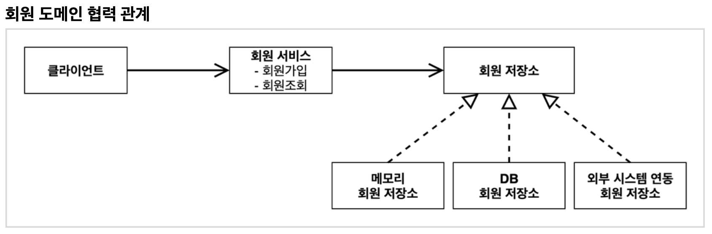
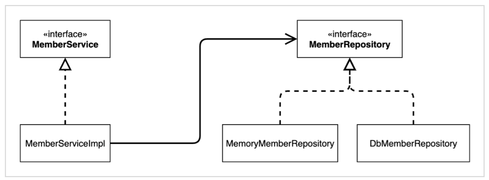

# Section 2. 스프링 핵심 원리 이해1 - 예제 만들기

## 프로젝트 생성

- Java 11
- IntelliJ

- Gradle
- Spring Boot 2.3.x
- groupId: hello
- artifactId: core
- Dependencies: 선택하지 않는다.


### Gradle 전체 설정

- build.gradle

  ```
  plugins {
  	id 'org.springframework.boot' version '2.7.5'
  	id 'io.spring.dependency-management' version '1.0.15.RELEASE'
  	id 'java'
  }
  
  group = 'hello'
  version = '0.0.1-SNAPSHOT'
  sourceCompatibility = '11'
  
  repositories {
  	mavenCentral()
  }
  
  dependencies {
  	implementation 'org.springframework.boot:spring-boot-starter'
  	testImplementation 'org.springframework.boot:spring-boot-starter-test'
  }
  
  tasks.named('test') {
  	useJUnitPlatform()
  }
  
  ```


### Intellij Gradle 대신 자바 직접 실행

최근 IntelliJ 버전은 Gradle을 통해서 실행 하는 것이 기본 설정이다. 이렇게 하면 실행속도가 느리다. 다음과 같이 변경하면 자바로 바로 실행해서 실행속도가 더 빠르다.

- Preferences -> Build, Exectuion, Deployment -> Build Tools -> Gradle
  - Build and run using: Gradle -> Intellij IDEA
  - Runt tests using: Gradle -> Intellij IDEA


## 비즈니스 요구사항과 설계

- 회원
  - 회원을 가입하고 조회할 수 있다.
  - 회원은 일반과 VIP 두 가지 등급이 있다.
  - 회원 데이터는 자체 DB를 구축할 수 있고, 외부 시스템과 연동할 수 있다. (미확정) => 인터페이스로 구현하면 그만
- 주문과 할인 정책
  - 회원은 상품을 주문할 수 있다.
  - 회원 등급에 따라 할인 정책을 적용할 수 있다.
  - 할인 정책은 모든 VIP는 1000원을 할인해주는 고정 금액 할인을 적용해달라. (나중에 변경될 수 있다.)
  - 할인 정책은 변경 가능성이 높다. 회사의 기본 할인 정책을 아직 정하지 못했고, 오픈 직전까지 고민을 미루고 싶다. 최악의 경우 할인을 적용하지 않을 수도 있다. (미확정)


요구사항을 보면 회원 데이터, 할인 정책 같은 부분은 지금 결정하기 어려운 부분이다. 그렇다고 이런 정책이 결정될 때까지 개발을 무기한 기다릴 수도 없다. 따라서 인터페이스를 만들고 구현체를 언제든지 갈아끼울 수 있도록 설계하면 된다. => 객체 지향 설계 방법 

> 참고: 프로젝트 환경설정을 편리하게 하려고 스프링 부트를 사용한 것이다. 지금은 스프링 없는 순수한 자바로만 개발을 진행한다. 스프링 관련은 한참 뒤에 등장한다.


## 회원 도메인 설계

- 회원 도메인 요구사항
  - 회원을 가입하고 조회할 수 있다.
  - 회원은 일반과 VIP 두 가지 등급이 있다.
  - 회원 데이터는 자체 DB를 구축할 수 있고, 외부 시스템과 연동할 수 있다. (미확정)

- 회원 도메인 협력 관계

  

- 회원 클래스 다이어그램

  

- 회원 객체 다이어그램

  

  - 회원 서비스: `MemberServiceImpl`


## 회원 도메인 개발

### 회원 엔티티

- 회원 등급

  ``` java
  package hello.core.member;
  
  public enum Grade {
    BASIC,
    VIP
  }
  ```

- 회원 엔티티

  ``` java
  package hello.core.member;
  
  public class Member {
  
      private Long id;
      private String name;
      private Grade grade;
  
      public Member(Long id, String name, Grade grade) {
          this.id = id;
          this.name = name;
          this.grade = grade;
      }
  
      public Long getId() {
          return id;
      }
  
      public void setId(Long id) {
          this.id = id;
      }
  
      public String getName() {
          return name;
      }
  
      public void setName(String name) {
          this.name = name;
      }
  
      public Grade getGrade() {
          return grade;
      }
  
      public void setGrade(Grade grade) {
          this.grade = grade;
      }
  
  }
  
  ```


### 회원 저장소

- 회원 저장소 인터페이스

  ``` java
  package hello.core.member;
  
  public interface MemberRepository {
  
      void save(Member member);
  
      Member findById(long memberId);
  }
  ```

- 메모리 회원 저장소 구현체

  ``` java
  package hello.core.member;
  
  public class MemberServiceImpl implements MemberService {
  
      private final MemberRepository memberRepository = new MemoryMemberRepository();
  
      @Override
      public void join(Member member) {
          memberRepository.save(member);
      }
  
      @Override
      public Member findMember(Long memberId) {
          return memberRepository.findById(memberId);
      }
  }
  ```

  - 데이터베이스가 아직 확정이 안되었다. 그래도 개발은 진행해야 하니 가장 단순한, 메모리 회원 저장소를 구현해서 우선 개발을 진행하자.

    > 참고: `HashMap` 은 동시성 이슈가 발생할 수 있다. 이런 경우 `ConcurrentHashMap` 을 사용하자.


### 회원 서비스

- 회원 서비스 인터페이스

  ``` java
  package hello.core.member;
  
  public interface MemberService {
  
      void join(Member member);
  
      Member findMember(Long memberId);
  }
  ```

- 회원 서비스 구현체

  ``` java
  package hello.core.member;
  
  public class MemberServiceImpl implements MemberService {
  
      private final MemberRepository memberRepository = new MemoryMemberRepository();
  
      @Override
      public void join(Member member) {
          memberRepository.save(member);
      }
  
      @Override
      public Member findMember(Long memberId) {
          return memberRepository.findById(memberId);
      }
  }
  ```


### 회언 도메인 실행과 테스트

- 회원 도메인 - 회원 가입 main

  ``` java
  package hello.core;
  
  import hello.core.member.Grade;
  import hello.core.member.Member;
  import hello.core.member.MemberService;
  import hello.core.member.MemberServiceImpl;
  
  public class SpringBeginnerApplication {
    public static void main(String[] args) {
      MemberService memberService = new MemberServiceImpl();
      Member member = new Member(1L, "memberA", Grade.VIP);
      memberService.join(member);
      
      Member findMember = memberSErvice.findMember(1L);
      System.out.println("new member = " + member.getName());
      System.out.println("find Member = " + findMember.getName());
    }
  }
  
  ```

  - 애플리케이션 로직으로 이렇게 테스트 하는 것은 좋은 방법이 아니다. JUnit 테스트 사용할 것!

- 회원 도메인 - 회원 가입 테스트

  ``` java
  package hello.core.member;
  
  import org.assertj.core.api.Assertions;
  import org.junit.jupiter.api.Test;
  
  import org.assertj.core.api.Assertions;
  
  class MemberServiceTest {
    MemberService memberService = new MemberService();
    
    @Test
    void join() {
      // given
      Member member = new Member(1L, "memberA", Grade.VIP);
      
      // when
      memberService.join(member);
      Member findMember = memberService.findMember(1L);
      
      // then
      assertThat(member).isEqualTo(findMember);
    }
  }
  ```


### 회원 도메인 설계의 문제점

- 다른 저장소로 변경할 때 OCP 원칙을 잘 준수할 수 있을까?
- DIP를 잘 지키고 있을까?
- 의존관계가 인터페이스 뿐만 아니라 구현까지 모두 의존하는 문제점이 있음 => 주문까지 만들고나서 문제점과 해결 방안 설명할 예정


