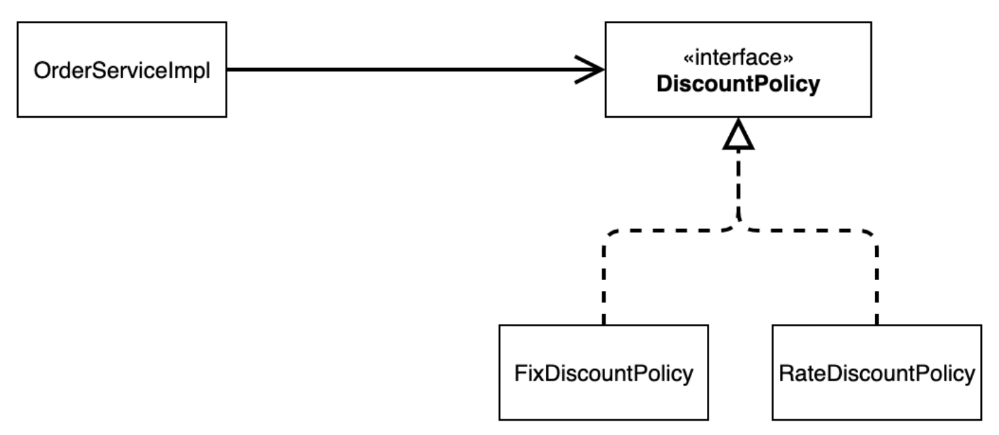
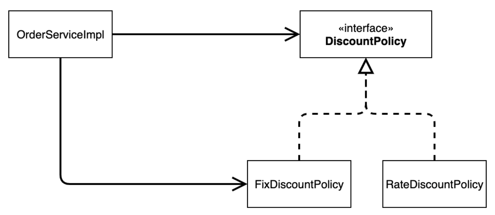
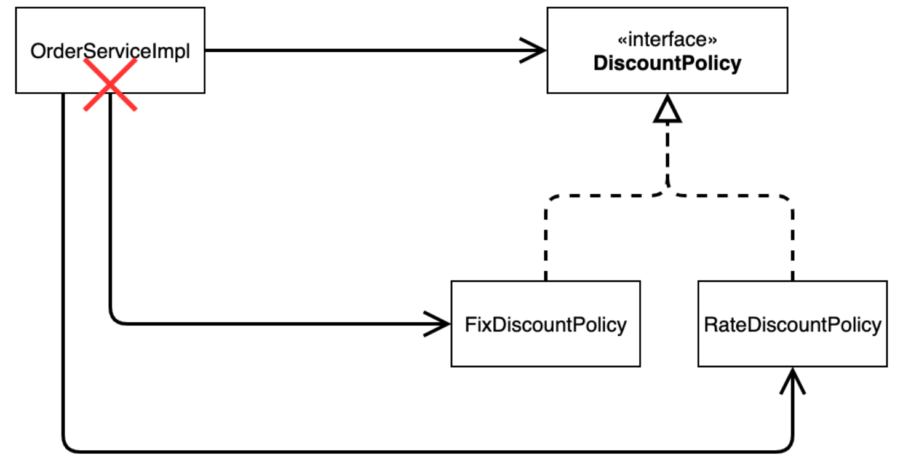
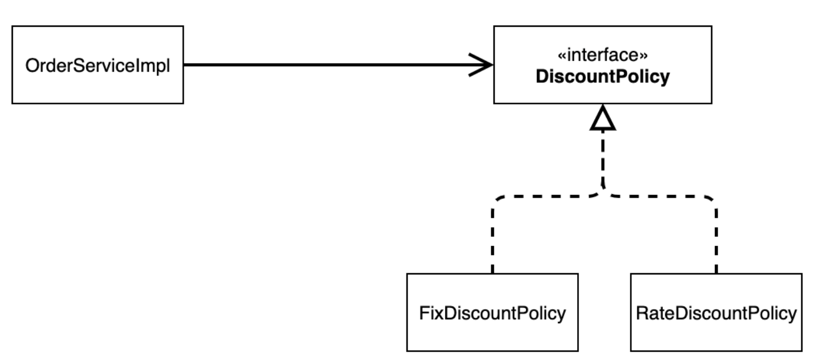

# Section 3. 스프링 핵심 원리 이해2 - 객체 지향 원리 적용

## 새로운 할인 정책 개발

- 악덕 기획자: 서비스 오픈 직전에 할인 정책을 지금처럼 고정 금액 할인이 아니라 좀 더 합리적인 주문 금액당 할인하는 정률% 할인으로 변경하고 싶어요. 예를 들어서 기존 정책은 VIP가 10000원을 주문하든 20000원을 주문하든 항상 1000원을 할인했는데, 이번에 새로 나온 정책은 10%로 지정해두면 고객이 10000원 주문시 1000원을 할인해주고, 20000원 주문시에 2000원을 할인해주는 거에요!
- 순진 개발자: 제가 처음부터 고정 금액 할인은 아니라고 했잖아요.
- 악덕 기획자: 애자일 소프트웨어 개발 선언 몰라요? "계획을 따르기보다 변화에 대응하기를"
- 순진 개발자: ... (하지만 난 유연한 설계가 가능하도록 객체지향 설계 원칙을 준수했지 후후)

> 참고: 애자일 소프트웨어 개발 선언 https://agilemanifesto.org/iso/ko/manifesto.html

이번에는 주문한 금액의 %를 할인해주는 새로운 정률 할인 정책을 추가하자.

- RateDiscountPolicy 추가

  ``` java
  package hello.core.discount;
  
  import hello.core.member.Grade;
  import hello.core.member.Member;
  
  public class RateDiscountPolicy implements DiscountPolicy {
      
      private int discountPercent = 10; // 10% 할인
      
      @Override
      public int discount(Member member, int price) {
          if (member.getGrade() == Grade.VIP) {
              return price * discountPercent / 100;
          } else {
              return 0;
          }
      }
  }
  
  ```

- 테스트 작성

  ``` java
  package hello.core.discount;
  
  import static org.assertj.core.api.Assertions.assertThat;
  
  import hello.core.member.Grade;
  import hello.core.member.Member;
  import org.junit.jupiter.api.DisplayName;
  import org.junit.jupiter.api.Test;
  
  class RateDiscountPolicyTest {
      RateDiscountPolicy discountPolicy = new RateDiscountPolicy();
  
      @Test
      @DisplayName("VIP는 10% 할인이 적용되어야 한다.")
      void vip_o() {
          // given
          Member member = new Member(1L, "memberVIP", Grade.VIP);
          // when
          int discount = discountPolicy.discount(member, 10000);
          // then
          assertThat(discount).isEqualTo(1000);
      }
  
      @Test
      @DisplayName("VIP가 아니면 할인이 적용되지 않아야 한다.")
      void vip_x() {
          // given
          Member member = new Member(2L, "memberBASIC", Grade.BASIC);
          // when
          int discount = discountPolicy.discount(member, 10000);
          // then
          assertThat(discount).isEqualTo(0);
      }
  }
  ```


### 새로운 할인 정책 적용과 문제점

- 할인 정책을 변경하려면 클라이언트인 `OrderServiceImpl` 코드를 고쳐야 한다.

  ``` java
  public class OrderServiceImpl implements OrderService {
    // private final DiscountPolicy discountPolicy = new FixDiscountPolicy();
    private final DiscountPolicy discountPolicy = new RateDiscountPolicy();
  }
  ```

- 문제점 발견

  - 역할과 구현을 충실하게 분리했다 :white_check_mark:
  - 다형성도 활용하고, 인터페이스와 구현 객체를 분리했다 :white_check_mark:
  - OCP, DIP 같은 객체지향 설계 원칙을 충실히 준수했다 :red_circle: => 그렇게 보이지만 사실은 아니다.
  - DIP: 주문서비스 클라이언트(`OrderServiceImpl`)는 `DiscountPolicy` 인터페이스에 의존하면서 DIP를 지킨 것 같은데?
    - 클래스 의존관계를 분석해보자. 추상(인터페이스) 뿐만 아니라 구현체 클래스에도 의존하고 있다.
      - 추상(인터페이스) 의존: `DiscountPolicy`
      - 구현체 클래스: `FixDiscountPolicy`, `RateDiscountPolicy`
  - OCP: 변경하지 않고 확장할 수 있다고 했는데!
    - 지금 코드는 기능을 확장해서 변경하면, 클라잉너트 코드에 영향을 준다! 따라서 OCP를 위반한다.


### 왜 클라이언트 코드를 변경해야 할까?

클래스 다이어그램으로 의존관계를 분석해보자.

- 기대했던 의존관계

  

  - 지금까지 단순히 `DiscountPolicy` 인터페이스만 의존한다고 생각했다.

- 실제 의존관계

  

  - 잘보면 클라이언트인 `OrderServiceImpl`이 `DiscountPolicy` 인터페이스 뿐만 아니라 `FixDiscountPolicy`인 구체 클래스도 함께 의존하고 있다. 실제 코드를 보면 의존하고 있다! => **DIP 위반**

- 정책 변경

  

  - **중요!** : 그래서 `FixDiscountPolicy`를 `RateDiscountPolicy` 로 변경하는 순간 `OrderServiceImpl` 의 소스코드도 함께 변경해야 한다! => **OCP 위반**


### 어떻게 문제를 해결할 수 있을까?

- 클라이언트 코드인 `OrderServiceImpl`은 `DiscountPolicy`의 인터페이스 뿐만 아니라 구체 클래스도 함께 의존한다.
- 그래서 구체 클래스를 변경할 때 클라이언트 코드도 함께 변경해야 한다.
- DIP 위반 -> 추상에만 의존하도록 변경(인터페이스에만 의존)
- DIP를 위반하지 않도록 인터페이스에만 의존하도록 의존관계를 변경하면 된다.


### 인터페이스에만 의존하도록 설계를 변경하자



``` java
public class OrderServiceImpl implements OrderService {
  // private final DiscountPolicy discountPolicy = new RateDiscountPolicy();
  private DiscountPolicy discountPolicy;
}
```

- 인터페이스에만 의존하도록 설계와 코드를 변경했다.
- 그런데 구현체가 없는데 어떻게 코드를 실행할 수 있을까?
- 실제 실행을 해보면 NPE가 발생한다.
- **해결방안**
  - <u>이 문제를 해결하려면 누군가가 클라이언트인 `OrderServiceImpl`에 `DiscountPolicy`의 구현 객체를 대신 생성하고 주입해주어야 한다.</u>


