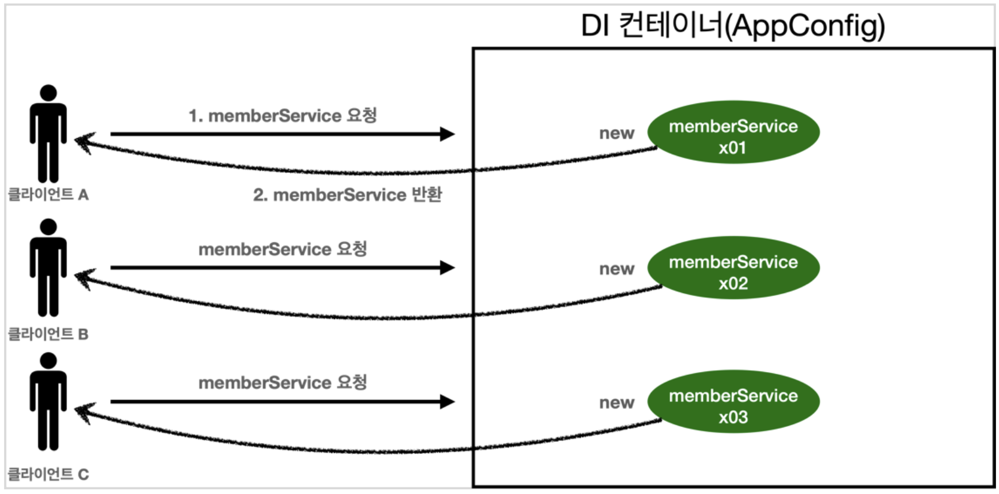

# Section 5. 싱글톤 컨테이너

## 웹 애플리케이션과 싱글톤

- 스프링은 태생이 기업용 온라인 서비스 기술을 지원하기 위해 탄생했다.
- 대부분의 스프링 애플리케이션은 웹 애플리케이션이다. 물론 웹이 아닌 애플리케이션 개발도 얼마든지 개발할 수 있다.
- 웹 애플리케이션은 보통 여러 고객이 동시에 요청을 한다.



``` java
package hello.core.singleton;

import static org.assertj.core.api.Assertions.assertThat;

import hello.core.AppConfig;
import hello.core.member.MemberService;
import org.junit.jupiter.api.DisplayName;
import org.junit.jupiter.api.Test;

public class SingletonTest {

    @Test
    @DisplayName("스프링 없는 순수한 DI 컨테이너")
    void pureContainer() {
        AppConfig appConfig = new AppConfig();
        // 1. 조회: 호출할 때마다 객체를 생성
        MemberService memberService1 = appConfig.memberService();

        // 2. 조회: 호출할 때마다 객체를 생성
        MemberService memberService2 = appConfig.memberService();
        
        // 참조값이 다른 것을 확인
        System.out.println("memberService1 = " + memberService1);
        System.out.println("memberService2 = " + memberService2);

        assertThat(memberService1).isNotSameAs(memberService2);
    }
}
```

- 우리가 만들었던 스프링 없는 순수한 DI 컨테이너인 AppConfig는 요청을 할 때마다 객체를 새로 생성한다.
- 고객 트래픽이 초당 100이 나오면 초당 100개 객체가 생성되고 소멸된다! -> 메모리 낭비가 심하다.
- 해결방안은 해당 객체가 딱 1개만 생성되고, 공유하도록 설계하면 된다. -> 싱글톤 패턴


